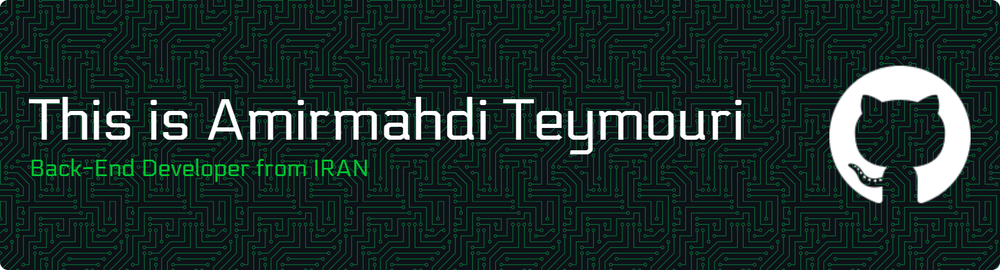

<!--

  

-->

<h1 align="center">Amir Mahdi Teymouri</h1>

<strong>Backend Engineer · .NET / ASP.NET Core · High‑Performance Systems</strong>

  
  
  

---

## Who I Am?

I’m a backend developer focused on **building fast, scalable, and maintainable systems** using the .NET ecosystem.

I care deeply about **architecture quality**, **performance**, and **long‑term maintainability**. I enjoy designing systems that stay clean under pressure and scale without surprises.

**What I work with daily:**

* Designing clean, layered architectures (and knowing when to break them)
* Building secure, production‑ready REST APIs
* Writing code that prioritizes clarity, performance, and correctness
* Making backend systems observable, reliable, and boring in production

---

## Core Expertise

* **Backend Development:** .NET, ASP.NET Core
* **Architecture:** Clean Architecture, Modular Monoliths, Microservices (in progress)
* **Security:** JWT, authentication & authorization pipelines
* **Databases:** Relational & NoSQL schema design, query optimization
* **Performance:** Profiling, memory efficiency, async/concurrency patterns
* **DevOps:** Docker, CI/CD pipelines, production readiness

---

## Tech Stack

  
  
  
  
  

  
  
  
  
  
  

---

## GitHub by the Numbers

  

  

  

---

## Current Focus

* Deepening expertise in **microservice architecture**
* Improving **system resilience and observability**
* Writing less code — but better code

---

## Let’s Talk

If you want to discuss backend architecture, performance problems, or system design trade‑offs, feel free to reach out.

**Email:** [am.tymri@gmail.com](mailto:am.tymri@gmail.com)
